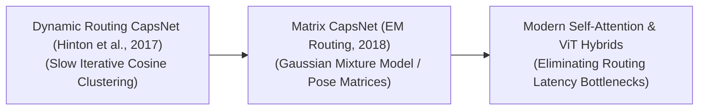

# 🚀 Awesome Capsule Networks 🧠

  

  

         
  

## 🌐 Capsule Networks (CapsNets): Evolution, Variants, Types, & Applications

> **SEO Description:** Discover the ultimate curated repository for Capsule Networks (CapsNets) evolution, routing variants, task layout types, and production engineering mitigations. Explore structural changes in machine learning architectures, dynamic routing, EM routing, and self-attention ViT hybrids for advanced computer vision applications.

Capsule Networks (CapsNets) represent a structural paradigm shift in computer vision and deep learning, designed to address the foundational limitations of traditional Convolutional Neural Networks (CNNs). Introduced by Sara Sabour, Nicholas Frosst, and Geoffrey Hinton in 2017, CapsNets replace scalar-output neurons with vector-output groups of neurons called **capsules**. While standard CNNs rely on max-pooling layers that completely discard spatial orientation and part-whole hierarchies—leading to the famous "Picasso problem" where an image with a mouth placed above the eyes is still classified as a face—CapsNet encodes both the *presence* of a feature and its explicit *spatial properties* (such as position, scale, rotation, and shear) as a multi-dimensional vector, using a unique **Dynamic Routing** algorithm to parse spatial configurations natively.

---

## ⏳ 1. The Chronological Evolution

The technical architecture of capsule-based networks has transitioned from rigid, slow iterative dynamic routing protocols to matrix transformations, moving toward modern fast attention approximations.

| Era / Milestone | First Used (Year) | Key Paper | Description |
| :--- | :--- | :--- | :--- |
| [**The Dynamic Routing Baseline Era**](docs/dynamic_routing_baseline.md) | 2017 | [Dynamic Routing Between Capsules](https://arxiv.org/abs/1710.09829) | Replaced scalar activations with vectors where the orientation represents instantiation parameters and the length represents activation probability. Introduced **Routing-by-Agreement** (iterative clustering based on cosine similarity of vectors). |
| [**The Expectation-Maximization & Matrix Era**](docs/em_routing_matrix.md) | 2018 | [Matrix Capsules with EM Routing](https://openreview.net/forum?id=HJ7tN1AZg) | Swapped vector capsules for matrix capsules holding a pose matrix. Substituted dynamic cosine tracking with an **EM (Expectation-Maximization)** routing algorithm based on a Gaussian mixture model. |
| [**The Attention-Driven & ViT Hybrid Era**](docs/attention_vit_hybrid.md) | 2021 | [Efficient-CapsNet: Capsule Networks with Self-Attention Routing](https://arxiv.org/abs/2101.12491) | Fuses capsule properties into Transformer architectures. Reframes routing-by-agreement as a specialized form of **Self-Attention** to eliminate routing latency. |

---

## ⚙️ 2. Core Functional & Routing Variants

The Capsule family tree features specialized mathematical routing modifications designed to optimize processing speed and reduce computational complexity.

| Routing Variant | First Used (Year) | Key Paper | Mechanism |
| :--- | :--- | :--- | :--- |
| [**Dynamic Routing (Cosine Agreement)**](docs/dynamic_routing_cosine.md) | 2017 | [Dynamic Routing Between Capsules](https://arxiv.org/abs/1710.09829) | Updates coupling coefficients iteratively via a log-prior scalar measuring the dot product between lower and upper layer vectors, applying a non-linear `squash` activation function. |
| [**EM Routing (Expectation-Maximization)**](docs/em_routing_mechanism.md) | 2018 | [Matrix Capsules with EM Routing](https://openreview.net/forum?id=HJ7tN1AZg) | Treats routing as a statistical clustering problem. Fits a Gaussian distribution to predictions of lower-level capsules, evaluating agreements based on clustering log-likelihoods. |
| [**Inverted Dot-Product Attention Routing (Fast CapsNet)**](docs/inverted_dot_product_attention.md) | 2020 | [Capsules with Inverted Dot-Product Attention Routing](https://arxiv.org/abs/2002.04704) | Eliminates multi-step runtime loops by computing attention maps across capsule channels in a single forward pass, mapping spatial transformation variables without stalling active execution graphs. |

---

## 📐 3. Structural Task & Layout Types

Depending on the operational constraints of the computer vision pipeline, capsule layers are configured across distinct geometric and dimension spaces.

| Layout / Network Type | First Used (Year) | Key Paper | Profile |
| :--- | :--- | :--- | :--- |
| [**2D Spatial Part-Whole CapsNets**](docs/spatial_2d_capsnets.md) | 2017 | [Dynamic Routing Between Capsules](https://arxiv.org/abs/1710.09829) | Applied to standard flat image canvas tracking. The capsules parameterize localized visual primitives (such as lines, corners, and object parts) and track their relative positions. |
| [**3D Volumetric / Point Cloud CapsNets**](docs/volumetric_3d_point_cloud.md) | 2018 | [3D Capsule Networks for Object Classification from 3D Model Data](https://arxiv.org/abs/1809.07172) | Ingests lidar coordinate clouds or volumetric medical data arrays natively. The pose matrices inside the capsules track absolute 3D spatial transforms, depth variables, and volumetric rotation vectors directly. |
| [**Deep Convolutional Capsule Stacks**](docs/deep_convolutional_capsule_stacks.md) | 2019 | [Deep Convolutional Capsule Network for Spectral-Spatial Classification](https://doi.org/10.1109/LGRS.2019.2918949) | Stacks standard convolutional layers early in the network graph to execute rough, low-level feature extraction, introducing capsule layers strictly within the deeper terminal blocks. |

---

## 🛠️ 4. Production Engineering Challenges & Mitigations

While Capsule Networks offer exceptional mathematical properties on paper, deploying them across industrial enterprise scales introduces severe computational bottlenecks.

| Challenge | First Used (Year) | Key Paper / Mitigation Source | Details & Mitigation |
| :--- | :--- | :--- | :--- |
| [**The Hardware Incompatibility & Latency Wall**](docs/hardware_incompatibility_latency.md) | 2020 | [Capsules with Inverted Dot-Product Attention Routing](https://arxiv.org/abs/2002.04704) / [Triton](https://dl.acm.org/doi/10.1145/3358807.3358808) | Iterative routing loops require sequential, dynamic memory allocation changes at runtime, preventing GPU/TPU tensor core saturation. Mitigation: transition to **Fused Attention CapsNet Kernels** or custom **Triton scripts** that handle vector updates within GPU SRAM registers. |
| [**The Parameter Explosion Problem**](docs/parameter_explosion.md) | 2018 | [Capsules for Object Segmentation](https://arxiv.org/abs/1804.04241) | Connecting every capsule pair requires a full transformation weight matrix, ballooning model parameter sizes for high-resolution datasets. Mitigation: Implementing **Shared Transformation Matrices** across coordinates, or localized **Group-Wise Quantization**. |

---

## 🌍 5. Frontier Real-World Applications

| Application Area | First Used (Year) | Key Paper | Description |
| :--- | :--- | :--- | :--- |
| [**High-Precision Medical Image Diagnostic Segmentation**](docs/medical_image_segmentation.md) | 2018 | [Capsules for Object Segmentation](https://arxiv.org/abs/1804.04241) | Processes detailed anatomical scans (MRIs, CT scans, ultrasound fields). Excels at segmenting tumors and tracing rare pathologies using highly sparse training datasets where standard CNNs overfit. |
| [**Aerospace & Satellite Volumetric Spatial Grounding**](docs/aerospace_satellite_grounding.md) | 2018 | [Remote Sensing Image Classification Based on Capsule Network](https://doi.org/10.1109/LGRS.2018.2818162) | Analyzes remote sensing data, satellite imagery, and radar tracking outputs. Capsule pose matrices decode perspective distortions, changing sunlight shadows, and high-altitude tilts natively. |
| [**Autonomous Robotic Manipulation & Pose Estimation**](docs/robotic_manipulation_pose.md) | 2019 | [GraspCaps: A Capsule Network Approach for Familiar 6DoF Object Grasping](https://arxiv.org/abs/1910.02103) | Drives real-time grasping and pick-and-place routing loops. Instantly decodes the absolute 3D orientation, tilt, and depth position of an un-indexed component to prevent collision errors. |

