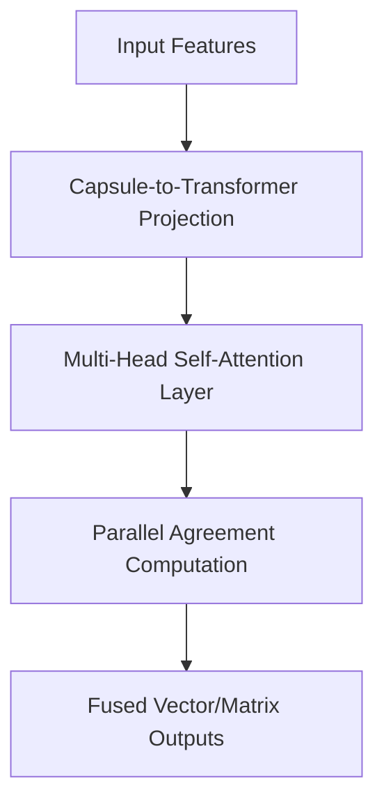

# The Attention-Driven & ViT Hybrid Era

## Detailed Information
Modern architectures (2021-Present) eliminate the slow, iterative dynamic routing loops by reframing capsule routing mathematically as a specialized form of self-attention. Fuses capsule properties into Vision Transformers (ViT) for fast, parallel execution.

## Architectural Diagram

---

[⬅️ Back to Main README](../README.md)
