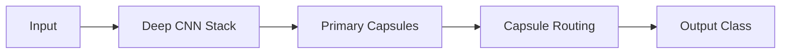

# Deep Convolutional Capsule Stacks

## Detailed Information
Combines the representation power of deep CNNs with the spatial hierarchy tracking of CapsNets. Uses CNN layers for initial feature extraction and Capsule layers for terminal semantic layout reasoning.

## Architectural Diagram

---

[⬅️ Back to Main README](../README.md)
