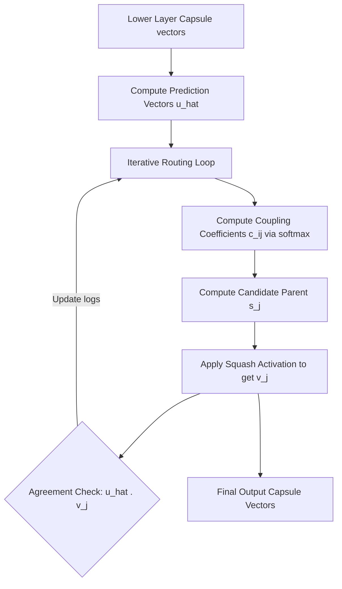

# The Dynamic Routing Baseline Era

## Detailed Information
Introduced by Sabour et al. in 2017, this era marked the foundational breakthrough of Capsule Networks. It replaced scalar activations with vectors where orientation represents instantiation parameters and length represents activation probability. It introduced Routing-by-Agreement.

## Architectural Diagram

---

[⬅️ Back to Main README](../README.md)
