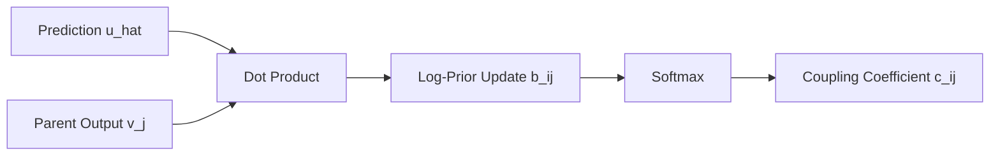

# Dynamic Routing (Cosine Agreement)

## Detailed Information
The routing mechanism used in the original 2017 CapsNet. It iteratively updates coupling coefficients using the dot product (cosine similarity) between predicted parent pose and actual parent output.

## Architectural Diagram

---

[⬅️ Back to Main README](../README.md)
