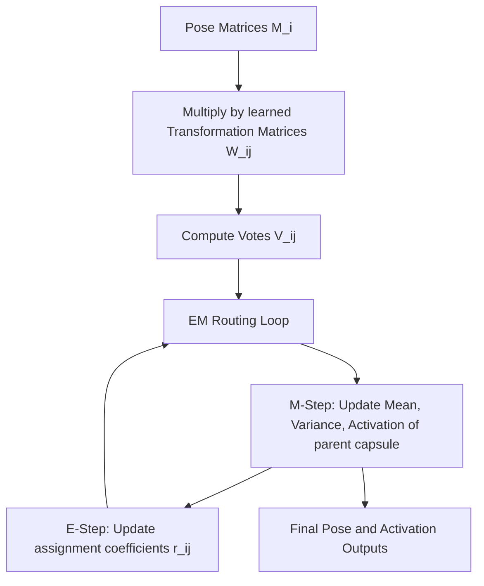

# The Expectation-Maximization & Matrix Era

## Detailed Information
Introduced in 2018 (Hinton et al.), this era swapped vector capsules for matrix capsules. Each capsule holds an activation scalar alongside a full 4x4 Pose Matrix representing spatial transformations. It uses EM Routing based on a Gaussian mixture model.

## Architectural Diagram

---

[⬅️ Back to Main README](../README.md)
