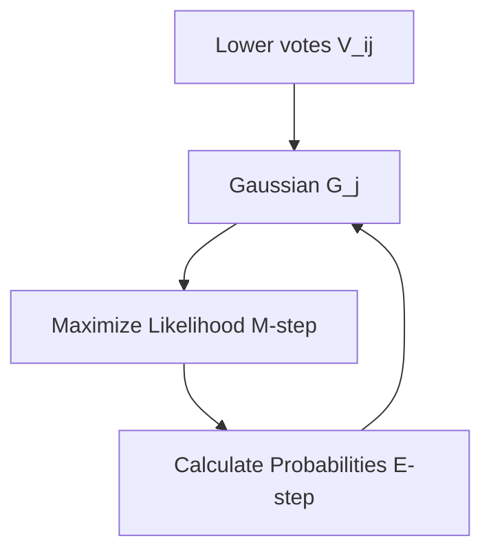

# EM Routing (Expectation-Maximization)

## Detailed Information
Treats capsule routing as a statistical clustering problem. Fits a Gaussian mixture model to the votes of lower-level capsules to determine assignment probabilities dynamically.

## Architectural Diagram

---

[⬅️ Back to Main README](../README.md)
