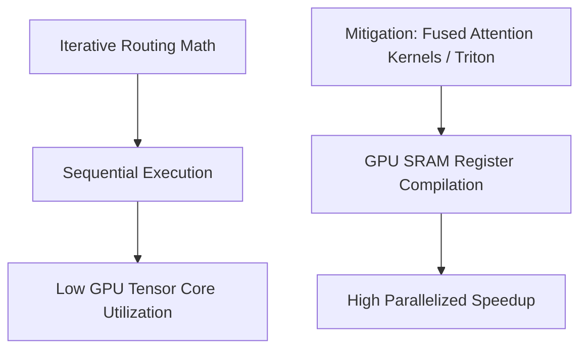

# The Hardware Incompatibility & Latency Wall

## Detailed Information
A deployment challenge stemming from iterative routing loops requiring sequential, dynamic memory allocations that do not saturate standard parallelized GPU tensor cores.

## Architectural Diagram

---

[⬅️ Back to Main README](../README.md)
