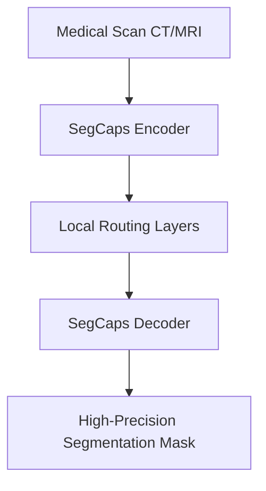

# High-Precision Medical Image Diagnostic Segmentation

## Detailed Information
Capsule networks excel in medical segmentation (e.g. lung and tumor CT/MRI scans) due to their spatial reasoning, allowing accurate tracking of anatomical layouts with minimal training data.

## Architectural Diagram

---

[⬅️ Back to Main README](../README.md)
