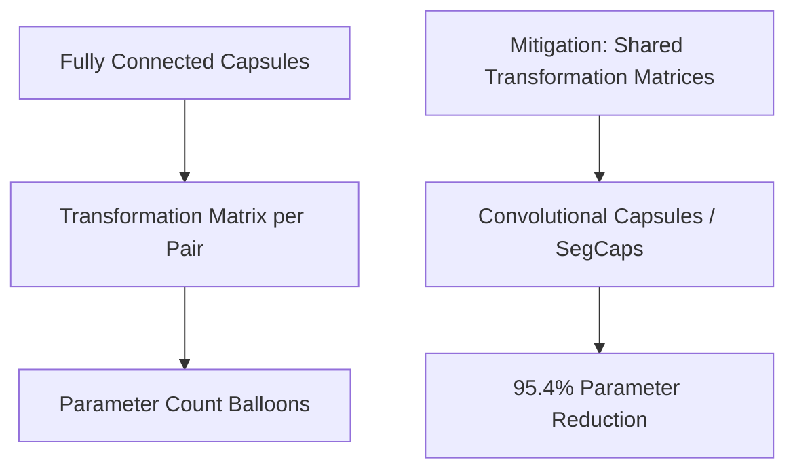

# The Parameter Explosion Problem

## Detailed Information
Because capsule connections require transformation matrices for every child-parent pair, scaling to high-resolution datasets causes the parameter count to balloon.

## Architectural Diagram

---

[⬅️ Back to Main README](../README.md)
