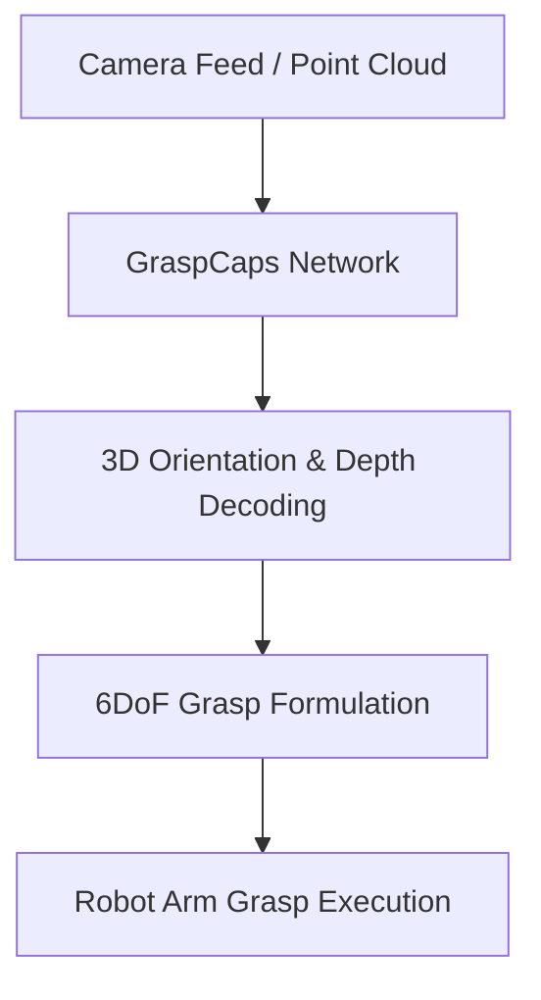

# Autonomous Robotic Manipulation & Pose Estimation

## Detailed Information
Drives real-time grasp planning and 3D pose estimation for robotic manipulators. Capsule networks decode 3D orientation and depth to allow precise physical interaction.

## Architectural Diagram

---

[⬅️ Back to Main README](../README.md)
