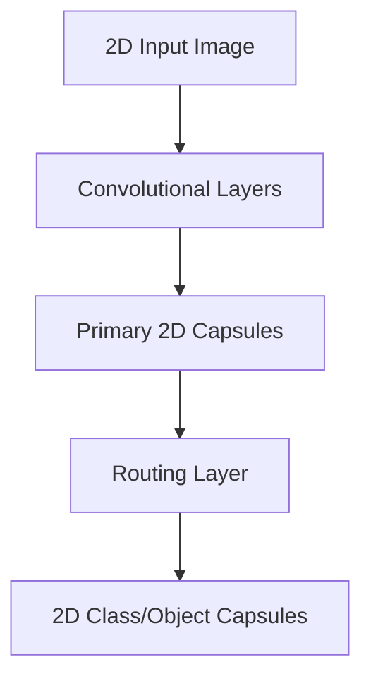

# 2D Spatial Part-Whole CapsNets

## Detailed Information
Configured for 2D visual tracking tasks. The capsules parameterize localized flat visual primitives (lines, corners) and capture their relative layout/hierarchical configuration.

## Architectural Diagram

---

[⬅️ Back to Main README](../README.md)
