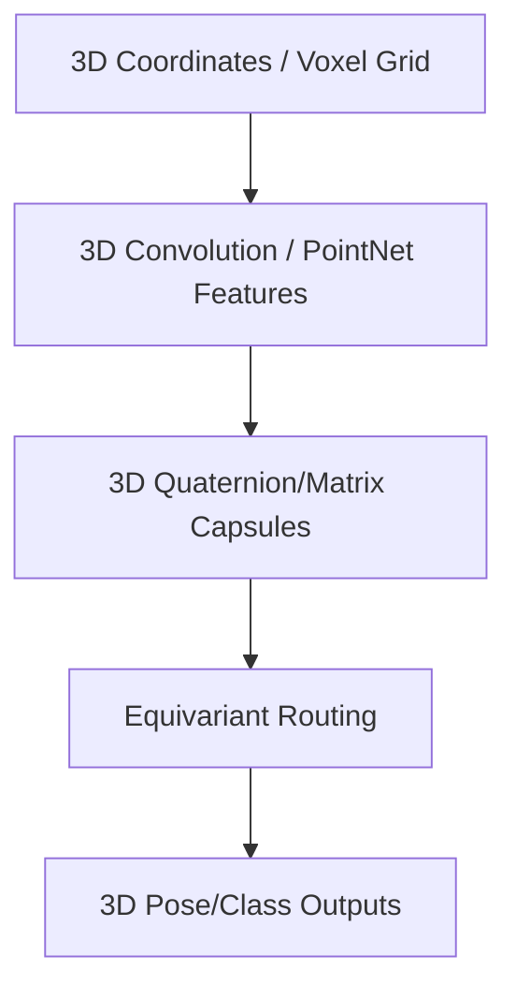

# 3D Volumetric / Point Cloud CapsNets

## Detailed Information
Natively processes 3D point cloud coordinate arrays or volumetric medical scans. Captures absolute 3D spatial transforms, rotations, and scales using equivariant capsule layers.

## Architectural Diagram

---

[⬅️ Back to Main README](../README.md)
